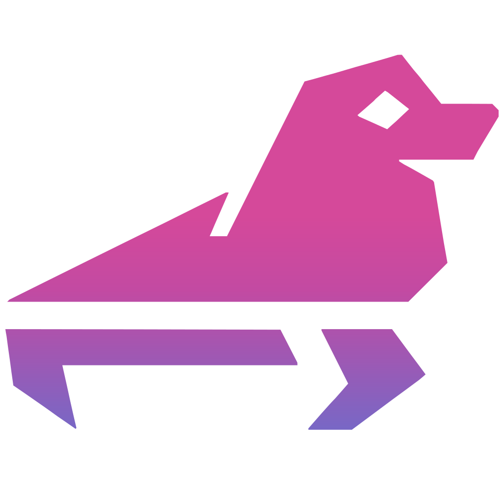

<p align="center"></p>

[](https://github.com/selkies-project/sealskin/actions/workflows/ci.yml)
[](https://github.com/selkies-project/sealskin/actions/workflows/prerelease.yml)
[](https://github.com/selkies-project/sealskin/actions/workflows/docs.yml)
[](https://github.com/selkies-project/sealskin/releases/latest)
[](https://opensource.org/licenses/MPL-2.0)
[](https://discord.com/invite/linuxserver)

**Your browser is your new computer.** SealSkin runs desktop applications in
isolated containers on a server you control and streams them to any browser
or phone. A browser extension turns every link, file, download and text
selection into something you can open remotely instead of locally, so nothing
from the web ever runs on the device in front of you.

SealSkin is built on [Selkies](https://github.com/selkies-project/selkies), the
low-latency Linux streaming stack, and on the
[LinuxServer.io](https://www.linuxserver.io) container catalogue. The project
site is <https://sealskin.app>.

## Get the clients

| Client | Install |
| --- | --- |
| Chrome, Edge, Brave and other Chromium browsers | [Chrome Web Store](https://chromewebstore.google.com/detail/sealskin-isolation/lclgfmnljgacfdpmmmjmfpdelndbbfhk) |
| Firefox | [Firefox Add-ons](https://addons.mozilla.org/en-US/firefox/addon/sealskin-isolation/) |
| iPhone and iPad | [App Store](https://apps.apple.com/us/app/sealskin/id6758210210) |
| Android | [Google Play](https://play.google.com/store/apps/details?id=io.linuxserver.sealskin) |
| Server | [linuxserver/sealskin](https://github.com/linuxserver/docker-sealskin) container image |

Every [release](https://github.com/selkies-project/sealskin/releases) also
carries the extension zips, the Android APK, the iOS IPA, the server wheel and
the built web UI for anyone who prefers to sideload.

## Get the server

The fastest route to a working server with a trusted TLS certificate is the
installer from the container repository. It needs Docker, a free
[Duck DNS](https://www.duckdns.org/) subdomain and its token:

```bash
mkdir sealskin && cd sealskin
bash <(curl -sSL https://raw.githubusercontent.com/linuxserver/docker-sealskin/refs/heads/master/install.sh)
```

[Getting Started](start.md) walks through that script, the plain
`docker compose` alternative, the first login and installing your first
application.

## What it does

* **Isolation.** Links, files, downloads and searches open in a fresh
  container on the server. Cleanroom sessions leave nothing behind; persistent
  home directories keep what you choose.
* **Any application.** Browsers, office suites, IDEs, media editors, emulators
  and 3D tools from the app stores, or any Selkies-compatible image you add
  yourself, with GPU acceleration on NVIDIA and DRI3 hardware.
* **Files stay on the server.** A built-in file manager, chunked uploads,
  drag-and-drop, intercepted downloads and password-protected public share
  links.
* **Collaboration rooms.** Launch any app into a room with chat, voice and
  video, gamepad slots and hand-over of mouse and keyboard control.
* **End-to-end encryption and no passwords.** Every API call is encrypted with
  a per-session AES key negotiated against the server's RSA key, and users
  authenticate with a signed JWT from a private key that never leaves the
  client.
* **One UI, served by the server.** The extension and the mobile app are thin
  shells; the launcher, dashboard, file manager and admin panels ship with the
  server image, so UI updates never wait for a store review.

## Documentation

[**Getting Started**](start.md): install the server, connect a client, launch
an application.

[**Usage**](usage.md): the launcher, context menus, sessions, storage, the file
manager and collaboration rooms.

[**Administration**](administration.md): users, groups, app stores, templates,
the App Laboratory and GPUs.

[**Configuration**](configuration.md): what lives in `/config` and `/storage`,
keys and certificates, and editing the YAML by hand.

[**Settings Reference**](settings.md): every environment variable the server
reads.

[**Architecture**](architecture.md): the control and data planes, the
encryption and authentication model, the served UI and the shells.

[**HTTP API**](api.md): every endpoint and how requests are wrapped.

[**Development**](development.md): running the server, building the client,
loading the extension, the mobile shells and this site.

[**Releasing**](releasing.md): versioning, release notes and the workflows.

[**Troubleshooting and FAQ**](faq.md): certificates, Firefox, mobile, GPUs
and Docker.

[**Server Reference**](reference/index.mdx): generated from the server's
docstrings.

## Support and source

* Source and issues: <https://github.com/selkies-project/sealskin>
* Container image: <https://github.com/linuxserver/docker-sealskin>
* Application catalogue: <https://github.com/linuxserver/sealskin-apps>
* Chat: the [LinuxServer.io Discord](https://discord.com/invite/linuxserver)

SealSkin is licensed under the
[Mozilla Public License 2.0](https://github.com/selkies-project/sealskin/blob/main/LICENSE).
The privacy policy for the published clients is
[PRIVACY.md](https://github.com/selkies-project/sealskin/blob/main/PRIVACY.md).
